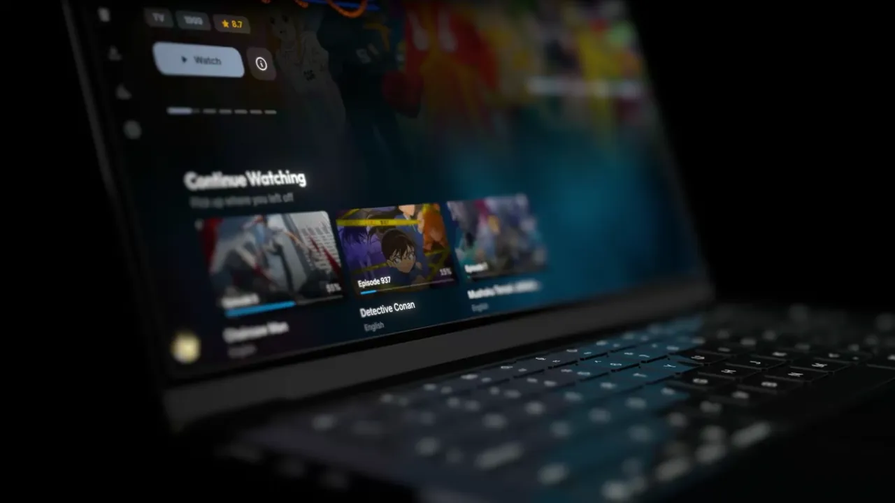

# AniSphere

**Every anime, in one native app for Windows, macOS and Linux.**

The whole catalogue lives on your disk, every episode plays from whichever source answers first,
and downloads keep working with no network at all. Free and open source.

 

 
